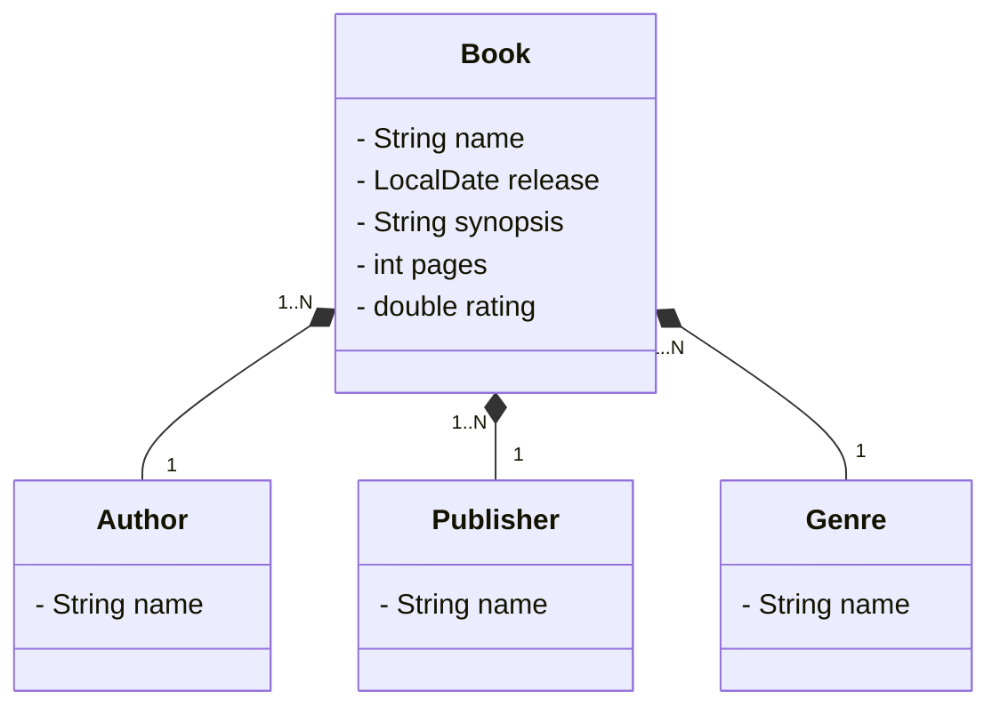

# Book API
API criada para o desafio "Publicando Sua API REST na Nuvem Usando Spring Boot 3,
Java 17 e Railway" da DIO.

Esta API salva informações de livros em um banco de dados.

Diagrama de classes:
